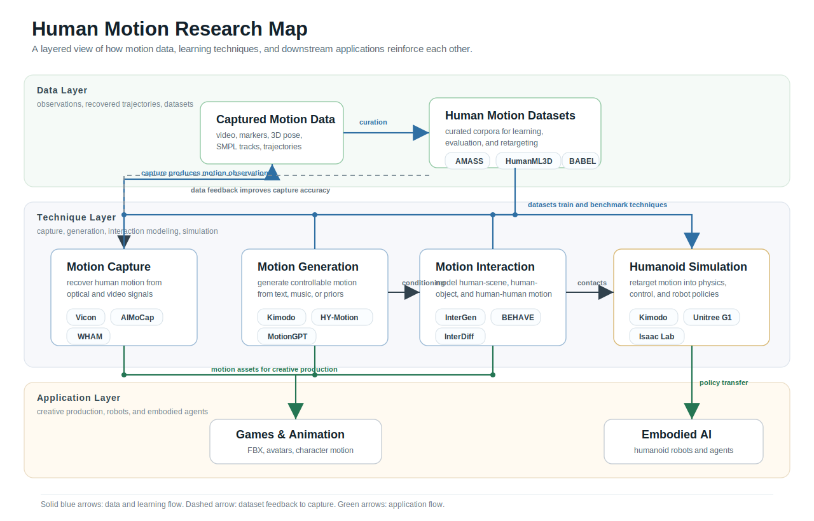

# Awesome Human Motion [](https://awesome.re)

A curated awesome list for **human motion capture, motion generation, motion interaction, humanoid simulation, motion video generation, human motion datasets, pose estimation, motion editing, motion stylization, human reconstruction, and motion understanding**.

<p align="center">
  <a href="CONTRIBUTING.md"></a>
</p>

## Human Motion Research Map



## What This List Covers

This awesome human motion list tracks human motion capture, video-to-motion, text-to-motion, motion generation, motion editing, motion stylization, motion interaction, pose estimation, human reconstruction, motion understanding, humanoid robot motion, embodied AI, motion video generation, and human motion datasets. AIMoCap appears as a motion capture resource in the table below with links to the [project page](https://animate-x.github.io/aimocap/?utm_source=awesome_human_motion&utm_medium=readme&utm_campaign=curation), [HF demo](https://huggingface.co/spaces/animtex/AIMoCap?utm_source=awesome_human_motion&utm_medium=readme&utm_campaign=curation), and [technical report](https://github.com/animate-x/aimocap-video2motion?utm_source=awesome_human_motion&utm_medium=readme&utm_campaign=curation).

## Related Awesome Lists

- [Foruck/Awesome-Human-Motion](https://github.com/Foruck/Awesome-Human-Motion)
- [derikon/awesome-human-motion](https://github.com/derikon/awesome-human-motion)
- [Zilize/awesome-text-to-motion](https://github.com/Zilize/awesome-text-to-motion)
- [showlab/Awesome-Video-Diffusion](https://github.com/showlab/Awesome-Video-Diffusion)

## Table of Contents

- [Reviews and Surveys](#reviews-and-surveys)
- [Motion Capture](#motion-capture)
- [Human Pose Estimation and Motion Reconstruction](#human-pose-estimation-and-motion-reconstruction)
- [Motion Generation](#motion-generation)
- [Motion Editing](#motion-editing)
- [Motion Stylization](#motion-stylization)
- [Motion Interaction](#motion-interaction)
- [Human-Object and Human-Scene Interaction](#human-object-and-human-scene-interaction)
- [Humanoid Simulation and Robot Motion](#humanoid-simulation-and-robot-motion)
- [Motion Video Generation](#motion-video-generation)
- [Human Avatar and Reconstruction](#human-avatar-and-reconstruction)
- [Human Motion Understanding](#human-motion-understanding)
- [Datasets and Benchmarks](#datasets-and-benchmarks)
- [Bio Motion and Biomechanics](#bio-motion-and-biomechanics)

## Format

| Date | Venue | Work | Project | GitHub | HF Demo | Paper |
| --- | --- | --- | --- | --- | --- | --- |

## Reviews and Surveys

| Date | Venue | Work | Project | GitHub | HF Demo | Paper |
| --- | --- | --- | --- | --- | --- | --- |
| 2025-07 | ArXiv 2025 | [Motion Generation Survey](https://arxiv.org/abs/2507.05419) | [Project](https://arxiv.org/abs/2507.05419) | - | - | [Paper](https://arxiv.org/abs/2507.05419) |
| 2025-03 | ArXiv 2025 | [3D Human Interaction Generation Survey](https://arxiv.org/abs/2503.13120) | [Project](https://arxiv.org/abs/2503.13120) | - | - | [Paper](https://arxiv.org/abs/2503.13120) |
| 2025-02 | ArXiv 2025 | [Human-Centric Foundation Models](https://arxiv.org/abs/2502.08556) | [Project](https://arxiv.org/abs/2502.08556) | - | - | [Paper](https://arxiv.org/abs/2502.08556) |
| 2025-01 | JEB 2025 | [Behavioural energetics in human locomotion: how energy use influences how we move](https://journals.biologists.com/jeb/article/228/Suppl_1/JEB248125/367009/Behavioural-energetics-in-human-locomotion-how) | [Project](https://journals.biologists.com/jeb/article/228/Suppl_1/JEB248125/367009/Behavioural-energetics-in-human-locomotion-how) | - | - | - |
| 2025-01 | ArXiv 2025 | [Advances in 4D Representation](https://arxiv.org/abs/2510.19255) | - | - | - | [Paper](https://arxiv.org/abs/2510.19255) |
| 2025-01 | ArXiv 2025 | [Grounding Intelligence in Movement](https://arxiv.org/abs/2506.03191) | - | - | - | [Paper](https://arxiv.org/abs/2506.03191) |
| 2025-01 | ArXiv 2025 | [Multimodal Generative AI with Autoregressive LLMs for Human Motion Understanding and Generation](https://arxiv.org/abs/2507.02771) | - | - | - | [Paper](https://arxiv.org/abs/2507.02771) |
| 2025-01 | ArXiv 2025 | [Generative AI for Character Animation](https://arxiv.org/abs/2504.19056) | - | - | - | [Paper](https://arxiv.org/abs/2504.19056) |
| 2025-01 | ArXiv 2025 | [A Survey on Human Interaction Motion Generation](https://arxiv.org/abs/2503.12763) | - | - | - | [Paper](https://arxiv.org/abs/2503.12763) |
| 2025-01 | ArXiv 2025 | [Humanoid Locomotion and Manipulation](https://arxiv.org/abs/2501.02116) | - | - | - | [Paper](https://arxiv.org/abs/2501.02116) |
| 2024-12 | ICER 2025 | [Motion Generation Review](https://arxiv.org/abs/2412.10458) | [Project](https://arxiv.org/abs/2412.10458) | - | - | [Paper](https://arxiv.org/abs/2412.10458) |
| 2024-07 | ArXiv 2024 | [Human Motion Video Generation Survey](https://github.com/Winn1y/Awesome-Human-Motion-Video-Generation) | [Project](https://github.com/Winn1y/Awesome-Human-Motion-Video-Generation) | [](https://github.com/Winn1y/Awesome-Human-Motion-Video-Generation) | - | [Paper](https://arxiv.org/abs/2407.08428) |
| 2024-01 | ArXiv 2024 | [Human Motion Video Generation](https://github.com/Winn1y/Awesome-Human-Motion-Video-Generation?tab=readme-ov-file) | [Project](https://github.com/Winn1y/Awesome-Human-Motion-Video-Generation?tab=readme-ov-file) | [](https://github.com/Winn1y/Awesome-Human-Motion-Video-Generation) | - | - |
| 2023-11 | CVPR 2024 | [VBench](https://vchitect.github.io/VBench-project/) | [Project](https://vchitect.github.io/VBench-project/) | [](https://github.com/Vchitect/VBench) | - | [Paper](https://arxiv.org/abs/2311.17982) |

## Motion Capture

| Date | Venue | Work | Project | GitHub | HF Demo | Paper |
| --- | --- | --- | --- | --- | --- | --- |
| 2026-06 | Tech Report 2026 | [AIMoCap Video2Motion](https://animate-x.github.io/aimocap/?utm_source=awesome_human_motion&utm_medium=readme&utm_campaign=curation) | [Project](https://animate-x.github.io/aimocap/?utm_source=awesome_human_motion&utm_medium=readme&utm_campaign=curation) | [](https://github.com/animate-x/aimocap-video2motion?utm_source=awesome_human_motion&utm_medium=readme&utm_campaign=curation) | [HF Demo](https://huggingface.co/spaces/animtex/AIMoCap?utm_source=awesome_human_motion&utm_medium=readme&utm_campaign=curation) | - |
| 2024-12 | CVPR 2025 | [GVHMR](https://zju3dv.github.io/gvhmr/) | [Project](https://zju3dv.github.io/gvhmr/) | [](https://github.com/zju3dv/GVHMR) | - | [Paper](https://arxiv.org/abs/2412.18086) |
| 2024-10 | CVPR 2025 | [TRAM](https://yufu-wang.github.io/tram4d/) | [Project](https://yufu-wang.github.io/tram4d/) | [](https://github.com/yufu-wang/tram) | - | [Paper](https://arxiv.org/abs/2410.13967) |
| 2024-03 | CVPR 2024 | [WHAM](https://wham.is.tue.mpg.de/) | [Project](https://wham.is.tue.mpg.de/) | [](https://github.com/yohanshin/WHAM) | - | [Paper](https://arxiv.org/abs/2312.07531) |
| 2024-03 | CVPR 2024 | [RoHM](https://sanweiliti.github.io/ROHM/ROHM.html) | [Project](https://sanweiliti.github.io/ROHM/ROHM.html) | [](https://github.com/sanweiliti/RoHM) | - | [Paper](https://arxiv.org/abs/2401.08518) |
| 2024-03 | CVPR 2024 | [TokenHMR](https://arxiv.org/abs/2404.16752) | - | [](https://github.com/saidwivedi/TokenHMR) | - | [Paper](https://arxiv.org/abs/2404.16752) |
| 2023-08 | ICCV 2023 | [4DHumans](https://shubham-goel.github.io/4dhumans/) | [Project](https://shubham-goel.github.io/4dhumans/) | [](https://github.com/shubham-goel/4D-Humans) | - | [Paper](https://arxiv.org/abs/2305.20091) |
| 2023-07 | ICCV 2023 | [MotionBERT](https://motionbert.github.io/) | [Project](https://motionbert.github.io/) | [](https://github.com/Walter0807/MotionBERT) | - | [Paper](https://arxiv.org/abs/2210.06551) |
| 2023-03 | CVPR 2023 | [SLAHMR](https://vye16.github.io/slahmr/) | [Project](https://vye16.github.io/slahmr/) | [](https://github.com/vye16/slahmr) | - | [Paper](https://arxiv.org/abs/2304.13952) |
| 2021-04 | CVPR 2021 | [HybrIK](https://jeffffffli.github.io/HybrIK/) | [Project](https://jeffffffli.github.io/HybrIK/) | [](https://github.com/Jeff-sjtu/HybrIK) | - | [Paper](https://arxiv.org/abs/2011.14672) |
| 2021-01 | Open Source | [XRMoCap](https://github.com/openxrlab/xrmocap) | [Project](https://github.com/openxrlab/xrmocap) | [](https://github.com/openxrlab/xrmocap) | - | - |
| 2020-09 | Open Source | [EasyMocap](https://github.com/zju3dv/EasyMocap) | [Project](https://github.com/zju3dv/EasyMocap) | [](https://github.com/zju3dv/EasyMocap) | - | - |

## Human Pose Estimation and Motion Reconstruction

| Date | Venue | Work | Project | GitHub | HF Demo | Paper |
| --- | --- | --- | --- | --- | --- | --- |
| 2026-06 | CVPR 2026 | [UST-Hand](https://arxiv.org/abs/2605.17742) | - | - | - | [Paper](https://arxiv.org/abs/2605.17742) |
| 2026-06 | CVPR 2026 | [E-3DPSM](https://arxiv.org/abs/2604.08543) | - | - | - | [Paper](https://arxiv.org/abs/2604.08543) |
| 2026-01 | ArXiv 2026 | [Map-Mono-Ego](https://arxiv.org/abs/2605.20889) | - | - | - | [Paper](https://arxiv.org/abs/2605.20889) |
| 2026-01 | ArXiv 2026 | [StableHand](https://arxiv.org/abs/2605.18553) | - | - | - | [Paper](https://arxiv.org/abs/2605.18553) |
| 2026-01 | FG 2026 | [Unsupervised 3D Human Pose Estimation](https://arxiv.org/abs/2605.15583) | - | - | - | [Paper](https://arxiv.org/abs/2605.15583) |
| 2026-01 | ArXiv 2026 | [Unconstrained Multi-view Human Pose Estimation with Algebraic Priors](https://arxiv.org/abs/2604.24312) | - | - | - | [Paper](https://arxiv.org/abs/2604.24312) |
| 2026-01 | ArXiv 2026 | [TAIHRI](https://arxiv.org/abs/2604.08921) | - | - | - | [Paper](https://arxiv.org/abs/2604.08921) |
| 2026-01 | ArXiv 2026 | [MoViD](https://arxiv.org/abs/2604.03299) | - | - | - | [Paper](https://arxiv.org/abs/2604.03299) |
| 2025-06 | CVPR 2025 | [SapiensID](https://arxiv.org/pdf/2504.04708) | [Project](https://arxiv.org/pdf/2504.04708) | - | - | - |
| 2025-06 | CVPR 2025 | [MV-SSM](https://aviralchharia.github.io/MV-SSM/) | [Project](https://aviralchharia.github.io/MV-SSM/) | - | - | - |
| 2025-06 | CVPR 2025 | [EnvPoser](https://arxiv.org/abs/2412.10235) | - | - | - | [Paper](https://arxiv.org/abs/2412.10235) |
| 2025-06 | CVPR 2025 | [ProbPose](https://mirapurkrabek.github.io/ProbPose/) | [Project](https://mirapurkrabek.github.io/ProbPose/) | - | - | - |

## Motion Generation

| Date | Venue | Work | Project | GitHub | HF Demo | Paper |
| --- | --- | --- | --- | --- | --- | --- |
| 2026-06 | CVPR 2026 | [Next-Scale Autoregressive Models](https://arxiv.org/abs/2604.03799) | - | - | - | [Paper](https://arxiv.org/abs/2604.03799) |
| 2026-03 | ArXiv 2026 | [Kimodo](https://research.nvidia.com/labs/toronto-ai/kimodo/) | [Project](https://research.nvidia.com/labs/toronto-ai/kimodo/) | [](https://github.com/nv-tlabs/kimodo) | [HF Demo](https://huggingface.co/spaces/nvidia/Kimodo) | [Paper](https://arxiv.org/abs/2603.15546) |
| 2026-01 | ArXiv 2026 | [HY-Motion-1.0](https://github.com/Tencent-Hunyuan/HY-Motion-1.0) | [Project](https://github.com/Tencent-Hunyuan/HY-Motion-1.0) | [](https://github.com/Tencent-Hunyuan/HY-Motion-1.0) | [HF Demo](https://huggingface.co/spaces/tencent/HY-Motion-1.0) | [Paper](https://arxiv.org/abs/2603.14477) |
| 2026-01 | ArXiv 2026 | [MotionVLA](https://arxiv.org/abs/2606.15142) | - | - | - | [Paper](https://arxiv.org/abs/2606.15142) |
| 2026-01 | ArXiv 2026 | [DC-Motion](https://arxiv.org/abs/2606.14721) | - | - | - | [Paper](https://arxiv.org/abs/2606.14721) |
| 2026-01 | ArXiv 2026 | [VideoMDM](https://arxiv.org/abs/2606.13364) | - | - | - | [Paper](https://arxiv.org/abs/2606.13364) |
| 2026-01 | ArXiv 2026 | [Sketch2Motion](https://arxiv.org/abs/2605.28394) | - | - | - | [Paper](https://arxiv.org/abs/2605.28394) |
| 2026-01 | ArXiv 2026 | [EchoAvatar](https://arxiv.org/abs/2605.28272) | - | - | - | [Paper](https://arxiv.org/abs/2605.28272) |
| 2026-01 | ArXiv 2026 | [Latent Dynamics for Full Body Avatar Animation](https://arxiv.org/abs/2605.21478) | - | - | - | [Paper](https://arxiv.org/abs/2605.21478) |
| 2026-01 | ArXiv 2026 | [DrawMotion](https://arxiv.org/abs/2605.20955) | - | - | - | [Paper](https://arxiv.org/abs/2605.20955) |
| 2026-01 | ArXiv 2026 | [ScaleMoGen](https://arxiv.org/abs/2605.11704) | - | - | - | [Paper](https://arxiv.org/abs/2605.11704) |
| 2026-01 | ArXiv 2026 | [Identity-Aware Human Motion and Shape Joint Generation](https://arxiv.org/abs/2604.25164) | - | - | - | [Paper](https://arxiv.org/abs/2604.25164) |
| 2026-01 | ArXiv 2026 | [Re2MoGen](https://arxiv.org/abs/2604.17807) | - | - | - | [Paper](https://arxiv.org/abs/2604.17807) |
| 2026-01 | ArXiv 2026 | [Marrying Text-to-Motion Generation with Skeleton-Based Action Recognition](https://arxiv.org/abs/2604.17090) | - | - | - | [Paper](https://arxiv.org/abs/2604.17090) |
| 2026-01 | ArXiv 2026 | [Motion-Adapter](https://arxiv.org/abs/2604.16135) | - | - | - | [Paper](https://arxiv.org/abs/2604.16135) |
| 2026-01 | ArXiv 2026 | [A Unified Conditional Flow for Motion Generation, Editing, and Intra-Structural Retargeting](https://arxiv.org/abs/2604.13427) | - | - | - | [Paper](https://arxiv.org/abs/2604.13427) |
| 2026-01 | ArXiv 2026 | [BiTDiff](https://arxiv.org/abs/2604.04395) | - | - | - | [Paper](https://arxiv.org/abs/2604.04395) |
| 2026-01 | ArXiv 2026 | [FlowCoMotion](https://arxiv.org/abs/2604.11083) | - | - | - | [Paper](https://arxiv.org/abs/2604.11083) |
| 2026-01 | ArXiv 2026 | [Exploring Motion-Language Alignment](https://arxiv.org/abs/2604.02973) | - | - | - | [Paper](https://arxiv.org/abs/2604.02973) |
| 2026-01 | ArXiv 2026 | [MotionRFT](https://arxiv.org/abs/2603.27185) | - | - | - | [Paper](https://arxiv.org/abs/2603.27185) |
| 2026-01 | ArXiv 2026 | [Unified Number-Free Text-to-Motion Generation Via Flow Matching](https://arxiv.org/abs/2603.27040) | - | - | - | [Paper](https://arxiv.org/abs/2603.27040) |
| 2026-01 | ArXiv 2026 | [From Diffusion To Flow](https://arxiv.org/abs/2603.26747) | - | - | - | [Paper](https://arxiv.org/abs/2603.26747) |
| 2025-07 | ICCV 2025 | [GENMO](https://research.nvidia.com/labs/dair/genmo/) | [Project](https://research.nvidia.com/labs/dair/genmo/) | - | - | - |
| 2025-06 | ICML 2025 | [Being-M0](https://beingbeyond.github.io/Being-M0/) | [Project](https://beingbeyond.github.io/Being-M0/) | - | - | [Paper](https://arxiv.org/abs/2410.03311) |
| 2025-06 | CVPR 2025 | [SALAD](https://seokhyeonhong.github.io/projects/salad/) | [Project](https://seokhyeonhong.github.io/projects/salad/) | [](https://github.com/seokhyeonhong/long-mib) | - | [Paper](https://arxiv.org/abs/2411.08097) |
| 2025-06 | CVPR 2025 | [LLaMo](https://github.com/ILGLJ/LLaMo) | [Project](https://github.com/ILGLJ/LLaMo) | [](https://github.com/ILGLJ/LLaMo) | - | [Paper](https://arxiv.org/abs/2411.16805) |
| 2024-10 | ECCV 2024 | [MotionLCM](https://dai-wenxun.github.io/MotionLCM-page/) | [Project](https://dai-wenxun.github.io/MotionLCM-page/) | [](https://github.com/Dai-Wenxun/MotionLCM) | - | [Paper](https://arxiv.org/abs/2404.19759) |
| 2024-08 | ECCV 2024 | [MoMask](https://ericguo5513.github.io/momask/) | [Project](https://ericguo5513.github.io/momask/) | [](https://github.com/EricGuo5513/momask-codes) | - | [Paper](https://arxiv.org/abs/2312.00063) |
| 2023-06 | CVPR 2023 | [MLD](https://chenxin.tech/mld/) | [Project](https://chenxin.tech/mld/) | [](https://github.com/ChenFengYe/motion-latent-diffusion) | - | [Paper](https://arxiv.org/abs/2304.10853) |
| 2023-06 | NeurIPS 2023 | [MotionGPT](https://motion-gpt.github.io/) | [Project](https://motion-gpt.github.io/) | [](https://github.com/OpenMotionLab/MotionGPT) | [HF Demo](https://huggingface.co/spaces/OpenMotionLab/MotionGPT) | [Paper](https://arxiv.org/abs/2306.10900) |
| 2023-06 | CVPR 2023 | [T2M-GPT](https://mael-zys.github.io/T2M-GPT/) | [Project](https://mael-zys.github.io/T2M-GPT/) | [](https://github.com/mael-zys/T2M-GPT) | [HF Demo](https://huggingface.co/spaces/vumichien/generate_human_motion) | [Paper](https://arxiv.org/abs/2301.06052) |
| 2022-10 | TPAMI 2024 | [MotionDiffuse](https://mingyuan-zhang.github.io/projects/MotionDiffuse.html) | [Project](https://mingyuan-zhang.github.io/projects/MotionDiffuse.html) | [](https://github.com/mingyuan-zhang/MotionDiffuse) | - | [Paper](https://arxiv.org/abs/2208.15001) |
| 2022-09 | ICLR 2023 | [MDM](https://guytevet.github.io/mdm-page/) | [Project](https://guytevet.github.io/mdm-page/) | [](https://github.com/GuyTevet/motion-diffusion-model) | - | [Paper](https://arxiv.org/abs/2209.14916) |

## Motion Editing

| Date | Venue | Work | Project | GitHub | HF Demo | Paper |
| --- | --- | --- | --- | --- | --- | --- |
| 2026-01 | ArXiv 2026 | [Skinned Motion Retargeting with Spatially Adaptive Interaction Guidance](https://arxiv.org/abs/2605.19355) | - | - | - | [Paper](https://arxiv.org/abs/2605.19355) |
| 2026-01 | ArXiv 2026 | [MotionMERGE](https://arxiv.org/abs/2605.18956) | - | - | - | [Paper](https://arxiv.org/abs/2605.18956) |
| 2026-01 | ArXiv 2026 | [ExpertEdit](https://arxiv.org/abs/2604.10466) | - | - | - | [Paper](https://arxiv.org/abs/2604.10466) |
| 2026-01 | ArXiv 2026 | [InterEdit](https://arxiv.org/abs/2603.13082) | - | - | - | [Paper](https://arxiv.org/abs/2603.13082) |
| 2025-10 | ICCV 2025 | [PRIMAL](https://yz-cnsdqz.github.io/eigenmotion/PRIMAL/) | [Project](https://yz-cnsdqz.github.io/eigenmotion/PRIMAL/) | - | - | - |
| 2025-06 | CVPR 2025 | [MixerMDM](https://www.pabloruizponce.com/papers/MixerMDM) | [Project](https://www.pabloruizponce.com/papers/MixerMDM) | - | - | - |
| 2025-06 | CVPR 2025 | [AnyMoLe](https://kwanyun.github.io/AnyMoLe_page/) | [Project](https://kwanyun.github.io/AnyMoLe_page/) | - | - | - |
| 2025-06 | CVPR 2025 | [SimMotionEdit](https://github.com/lzhyu/SimMotionEdit) | [Project](https://github.com/lzhyu/SimMotionEdit) | [](https://github.com/lzhyu/SimMotionEd) | - | - |
| 2025-06 | CVPR 2025 | [MotionReFit](https://awfuact.github.io/motionrefit/) | [Project](https://awfuact.github.io/motionrefit/) | - | - | - |
| 2025-01 | IVA 2025 | [TF-JAX-IK](https://arxiv.org/abs/2507.00792) | - | - | - | [Paper](https://arxiv.org/abs/2507.00792) |

## Motion Stylization

| Date | Venue | Work | Project | GitHub | HF Demo | Paper |
| --- | --- | --- | --- | --- | --- | --- |
| 2025-10 | ICCV 2025 | [StyleMotif](https://stylemotif.github.io/) | [Project](https://stylemotif.github.io/) | - | - | - |
| 2025-06 | CVPR 2025 | [Visual Persona](https://cvlab-kaist.github.io/Visual-Persona/) | [Project](https://cvlab-kaist.github.io/Visual-Persona/) | - | - | - |
| 2025-01 | ArXiv 2025 | [ClusterStyle](https://arxiv.org/abs/2512.02453) | - | - | - | [Paper](https://arxiv.org/abs/2512.02453) |
| 2025-01 | ArXiv 2025 | [MotionPersona](https://arxiv.org/abs/2506.00173) | - | - | - | [Paper](https://arxiv.org/abs/2506.00173) |
| 2025-01 | ArXiv 2025 | [AStF](https://arxiv.org/abs/2511.04192) | - | - | - | [Paper](https://arxiv.org/abs/2511.04192) |
| 2025-01 | ArXiv 2025 | [Dance Like a Chicken](https://haimsaw.github.io/LoRA-MDM/) | [Project](https://haimsaw.github.io/LoRA-MDM/) | - | - | - |
| 2024-01 | ArXiv 2024 | [MulSMo](https://arxiv.org/abs/2412.09901) | - | - | - | [Paper](https://arxiv.org/abs/2412.09901) |
| 2024-01 | TSMC 2024 | [D-LORD](https://arxiv.org/abs/2412.04097) | - | - | - | [Paper](https://arxiv.org/abs/2412.04097) |

## Motion Interaction

| Date | Venue | Work | Project | GitHub | HF Demo | Paper |
| --- | --- | --- | --- | --- | --- | --- |
| 2026-06 | CVPR 2026 | [ReMoGen](https://arxiv.org/abs/2604.01082) | - | - | - | [Paper](https://arxiv.org/abs/2604.01082) |
| 2026-06 | CVPR 2026 | [Learning to Assist](https://arxiv.org/abs/2603.11346) | - | - | - | [Paper](https://arxiv.org/abs/2603.11346) |
| 2026-02 | AAAI 2026 | [InterMoE](https://arxiv.org/abs/2511.13488) | - | - | - | [Paper](https://arxiv.org/abs/2511.13488) |
| 2026-01 | ArXiv 2026 | [Contact Matrix](https://arxiv.org/abs/2605.04662) | - | - | - | [Paper](https://arxiv.org/abs/2605.04662) |
| 2026-01 | ArXiv 2026 | [Stability-Driven Motion Generation for Object-Guided Human-Human Co-Manipulation](https://arxiv.org/abs/2604.20336) | - | - | - | [Paper](https://arxiv.org/abs/2604.20336) |
| 2026-01 | ArXiv 2026 | [Rhythm](https://arxiv.org/abs/2603.02856) | - | - | - | [Paper](https://arxiv.org/abs/2603.02856) |
| 2026-01 | ArXiv 2026 | [HINT](https://arxiv.org/abs/2601.20383) | - | - | - | [Paper](https://arxiv.org/abs/2601.20383) |
| 2025-10 | ICCV 2025 | [Ponimator](https://stevenlsw.github.io/ponimator/) | [Project](https://stevenlsw.github.io/ponimator/) | - | - | - |
| 2024-10 | ArXiv 2024 | [InterMask](https://github.com/neu-vi/InterMask) | [Project](https://github.com/neu-vi/InterMask) | [](https://github.com/neu-vi/InterMask) | - | [Paper](https://arxiv.org/abs/2410.17144) |
| 2024-06 | CVPR 2024 | [HOI-Diff](https://neu-vi.github.io/HOI-Diff/) | [Project](https://neu-vi.github.io/HOI-Diff/) | [](https://github.com/neu-vi/HOI-Diff) | - | [Paper](https://arxiv.org/abs/2312.06553) |
| 2024-03 | ICLR 2024 | [ComMDM](https://sinmdm.github.io/ComMDM-page/) | [Project](https://sinmdm.github.io/ComMDM-page/) | [](https://github.com/SinMDM/ComMDM) | - | [Paper](https://arxiv.org/abs/2308.02659) |
| 2024-01 | IJCV 2024 | [InterGen](https://tr3e.github.io/intergen-page/) | [Project](https://tr3e.github.io/intergen-page/) | [](https://github.com/tr3e/InterGen) | - | [Paper](https://arxiv.org/abs/2304.05684) |
| 2023-09 | Dataset | [InterHuman](https://tr3e.github.io/intergen-page/) | [Project](https://tr3e.github.io/intergen-page/) | [](https://github.com/tr3e/InterGen) | - | [Paper](https://arxiv.org/abs/2304.05684) |
| 2023-03 | ICCV 2023 | [InterDiff](https://sirui-xu.github.io/InterDiff/) | [Project](https://sirui-xu.github.io/InterDiff/) | [](https://github.com/sirui-xu/InterDiff) | - | [Paper](https://arxiv.org/abs/2306.04806) |
| 2023-03 | CVPR 2023 | [OMOMO](https://lijiaman.github.io/projects/omomo/) | [Project](https://lijiaman.github.io/projects/omomo/) | [](https://github.com/lijiaman/omomo_release) | - | [Paper](https://arxiv.org/abs/2303.15983) |
| 2022-06 | CVPR 2022 | [BEHAVE](https://virtualhumans.mpi-inf.mpg.de/behave/) | [Project](https://virtualhumans.mpi-inf.mpg.de/behave/) | [](https://github.com/virtualhumans/behave) | - | [Paper](https://arxiv.org/abs/2204.06950) |

## Human-Object and Human-Scene Interaction

| Date | Venue | Work | Project | GitHub | HF Demo | Paper |
| --- | --- | --- | --- | --- | --- | --- |
| 2026-06 | CVPR 2026 | [ViHOI](https://arxiv.org/abs/2603.24383) | - | - | - | [Paper](https://arxiv.org/abs/2603.24383) |
| 2026-06 | CVPR 2026 | [TeamHOI](https://arxiv.org/abs/2603.07988) | - | - | - | [Paper](https://arxiv.org/abs/2603.07988) |
| 2026-05 | ICLR 2026 | [InfBaGel](https://arxiv.org/abs/2604.04843) | - | - | - | [Paper](https://arxiv.org/abs/2604.04843) |
| 2026-01 | ArXiv 2026 | [MaMi-HOI](https://arxiv.org/abs/2605.05756) | - | - | - | [Paper](https://arxiv.org/abs/2605.05756) |
| 2026-01 | ArXiv 2026 | [Hoi3DGen](https://arxiv.org/abs/2603.12126) | - | - | - | [Paper](https://arxiv.org/abs/2603.12126) |
| 2026-01 | ArXiv 2026 | [InterReal](https://arxiv.org/abs/2603.07516) | - | - | - | [Paper](https://arxiv.org/abs/2603.07516) |
| 2026-01 | ArXiv 2026 | [InterPrior](https://sirui-xu.github.io/InterPrior/) | [Project](https://sirui-xu.github.io/InterPrior/) | - | - | - |
| 2026-01 | ArXiv 2026 | [ArtHOI](https://arxiv.org/abs/2603.04338) | - | - | - | [Paper](https://arxiv.org/abs/2603.04338) |
| 2026-01 | ArXiv 2026 | [SceMoS](https://arxiv.org/abs/2602.20476) | - | - | - | [Paper](https://arxiv.org/abs/2602.20476) |
| 2026-01 | ArXiv 2026 | [Dynamic Worlds, Dynamic Humans](https://arxiv.org/abs/2601.19484) | - | - | - | [Paper](https://arxiv.org/abs/2601.19484) |
| 2026-01 | ArXiv 2026 | [CHOIR](https://arxiv.org/abs/2605.20992) | - | - | - | [Paper](https://arxiv.org/abs/2605.20992) |
| 2026-01 | ArXiv 2026 | [HOIGS](https://arxiv.org/abs/2604.04016) | - | - | - | [Paper](https://arxiv.org/abs/2604.04016) |
| 2025-12 | NeurIPS 2025 | [HHOI](https://tlb-miss.github.io/hhoi/) | [Project](https://tlb-miss.github.io/hhoi/) | - | - | - |
| 2025-10 | ACM MM 2025 | [PA-HOI](https://arxiv.org/abs/2508.06205) | - | - | - | [Paper](https://arxiv.org/abs/2508.06205) |
| 2025-10 | ICCV 2025 | [Being-M0.5](https://beingbeyond.github.io/Being-M0.5/) | [Project](https://beingbeyond.github.io/Being-M0.5/) | - | - | - |
| 2025-10 | ICCV 2025 | [SceneMI](http://inwoohwang.me/SceneMI) | [Project](http://inwoohwang.me/SceneMI) | - | - | - |
| 2025-10 | ICCV 2025 | [SIMS](https://arxiv.org/abs/2411.19921) | - | - | - | [Paper](https://arxiv.org/abs/2411.19921) |
| 2025-10 | ICCV 2025 | [Event-Driven Storytelling with Multiple Lifelike Humans in a 3D scene](https://rms0329.github.io/Event-Driven-Storytelling/) | [Project](https://rms0329.github.io/Event-Driven-Storytelling/) | - | - | - |
| 2025-06 | CVPR 2025 | [Reconstructing In-the-Wild Open-Vocabulary Human-Object Interactions](https://wenboran2002.github.io/3dhoi/) | [Project](https://wenboran2002.github.io/3dhoi/) | - | - | - |
| 2025-06 | CVPR 2025 | [InteractVLM](https://interactvlm.is.tue.mpg.de) | [Project](https://interactvlm.is.tue.mpg.de) | - | - | - |
| 2025-06 | CVPR 2025 | [PICO](https://pico.is.tue.mpg.de) | [Project](https://pico.is.tue.mpg.de) | - | - | - |
| 2025-06 | CVPR 2025 | [EasyHOI](https://lym29.github.io/EasyHOI-page/) | [Project](https://lym29.github.io/EasyHOI-page/) | - | - | - |

## Humanoid Simulation and Robot Motion

| Date | Venue | Work | Project | GitHub | HF Demo | Paper |
| --- | --- | --- | --- | --- | --- | --- |
| 2026-03 | ArXiv 2026 | [Kimodo Robot Motion](https://research.nvidia.com/labs/toronto-ai/kimodo/) | [Project](https://research.nvidia.com/labs/toronto-ai/kimodo/) | [](https://github.com/nv-tlabs/kimodo) | [HF Demo](https://huggingface.co/spaces/nvidia/Kimodo) | [Paper](https://arxiv.org/abs/2603.15546) |
| 2026-01 | ArXiv 2026 | [VENOM](https://arxiv.org/abs/2606.16696) | - | - | - | [Paper](https://arxiv.org/abs/2606.16696) |
| 2026-01 | ArXiv 2026 | [WaveSync](https://arxiv.org/abs/2606.16600) | - | - | - | [Paper](https://arxiv.org/abs/2606.16600) |
| 2026-01 | ArXiv 2026 | [ADAPT](https://arxiv.org/abs/2606.16542) | - | - | - | [Paper](https://arxiv.org/abs/2606.16542) |
| 2026-01 | ArXiv 2026 | [λ-Reachability](https://arxiv.org/abs/2606.16022) | - | - | - | [Paper](https://arxiv.org/abs/2606.16022) |
| 2026-01 | ArXiv 2026 | [WT-UMI](https://arxiv.org/abs/2606.13232) | - | - | - | [Paper](https://arxiv.org/abs/2606.13232) |
| 2026-01 | ArXiv 2026 | [Proprioceptive-visual correspondence enables self-other distinction in humanoid robots](https://arxiv.org/abs/2606.13222) | - | - | - | [Paper](https://arxiv.org/abs/2606.13222) |
| 2026-01 | ArXiv 2026 | [GenHOI](https://arxiv.org/abs/2606.12995) | - | - | - | [Paper](https://arxiv.org/abs/2606.12995) |
| 2026-01 | ArXiv 2026 | [Stubborn](https://arxiv.org/abs/2606.12814) | - | - | - | [Paper](https://arxiv.org/abs/2606.12814) |
| 2026-01 | ArXiv 2026 | [Critic Architecture Matters](https://arxiv.org/abs/2606.11891) | - | - | - | [Paper](https://arxiv.org/abs/2606.11891) |
| 2026-01 | ArXiv 2026 | [RoboNaldo](https://arxiv.org/abs/2606.11092) | - | - | - | [Paper](https://arxiv.org/abs/2606.11092) |
| 2026-01 | ArXiv 2026 | [MARCH](https://arxiv.org/abs/2606.10288) | - | - | - | [Paper](https://arxiv.org/abs/2606.10288) |
| 2026-01 | ArXiv 2026 | [VAIC](https://arxiv.org/abs/2606.09286) | - | - | - | [Paper](https://arxiv.org/abs/2606.09286) |
| 2025-02 | ArXiv 2025 | [ASAP](https://agile.human2humanoid.com/) | [Project](https://agile.human2humanoid.com/) | [](https://github.com/agilexrobotics/asap) | - | [Paper](https://arxiv.org/abs/2502.01143) |
| 2024-10 | ArXiv 2024 | [HOVER](https://hover-versatile-humanoid.github.io/) | [Project](https://hover-versatile-humanoid.github.io/) | [](https://github.com/hover-versatile-humanoid/hover) | - | [Paper](https://arxiv.org/abs/2410.21229) |
| 2024-05 | Robot Platform | [Unitree G1 Developer Resources](https://www.unitree.com/g1/) | [Project](https://www.unitree.com/g1/) | [](https://github.com/unitreerobotics/unitree_sdk2) | - | - |
| 2024-03 | NeurIPS 2024 | [HumanoidBench](https://humanoid-bench.github.io/) | [Project](https://humanoid-bench.github.io/) | [](https://github.com/cmu-humanoid-bench/humanoid-bench) | - | [Paper](https://arxiv.org/abs/2403.10506) |
| 2024-01 | Toolkit | [Isaac Lab Humanoid](https://isaac-sim.github.io/IsaacLab/) | [Project](https://isaac-sim.github.io/IsaacLab/) | [](https://github.com/isaac-sim/IsaacLab) | - | - |
| 2023-05 | SIGGRAPH 2023 | [PHC](https://zhengyiluo.github.io/PHC-Site/) | [Project](https://zhengyiluo.github.io/PHC-Site/) | [](https://github.com/ZhengyiLuo/PHC) | - | [Paper](https://arxiv.org/abs/2305.15475) |
| 2022-06 | SIGGRAPH 2022 | [ASE](https://xbpeng.github.io/projects/ASE/index.html) | [Project](https://xbpeng.github.io/projects/ASE/index.html) | [](https://github.com/nv-tlabs/ASE) | - | [Paper](https://arxiv.org/abs/2205.01906) |
| 2021-04 | SIGGRAPH 2021 | [AMP](https://xbpeng.github.io/projects/AMP/index.html) | [Project](https://xbpeng.github.io/projects/AMP/index.html) | [](https://github.com/xbpeng/DeepMimic) | - | [Paper](https://arxiv.org/abs/2104.02180) |

## Motion Video Generation

| Date | Venue | Work | Project | GitHub | HF Demo | Paper |
| --- | --- | --- | --- | --- | --- | --- |
| 2026-01 | ArXiv 2026 | [AnyAct](https://arxiv.org/abs/2605.15497) | - | - | - | [Paper](https://arxiv.org/abs/2605.15497) |
| 2025-06 | CVPR 2025 | [EchoMimicV2](https://antgroup.github.io/ai/echomimic_v2/) | [Project](https://antgroup.github.io/ai/echomimic_v2/) | [](https://github.com/antgroup/echomimic_v2) | - | [Paper](https://arxiv.org/abs/2411.10061) |
| 2025-06 | CVPR 2025 | [HumanDreamer](https://humandreamer.github.io/) | [Project](https://humandreamer.github.io/) | [](https://github.com/humandreamer/HumanDreamer) | - | [Paper](https://arxiv.org/abs/2503.24026) |
| 2025-06 | CVPR 2025 | [FinePhys](https://smartdianlab.github.io/projects-FinePhys/) | [Project](https://smartdianlab.github.io/projects-FinePhys/) | - | - | - |
| 2025-06 | CVPR 2025 | [Boost Your Human Image Generation Model via Direct Preference Optimization](https://arxiv.org/pdf/2405.20216) | [Project](https://arxiv.org/pdf/2405.20216) | - | - | - |
| 2025-04 | CVPR 2025 | [TokenMotion](https://arxiv.org/abs/2504.08181) | - | - | - | [Paper](https://arxiv.org/abs/2504.08181) |
| 2025-03 | ArXiv 2025 | [X-UniMotion](https://byteaigc.github.io/X-Unimotion/) | [Project](https://byteaigc.github.io/X-Unimotion/) | - | - | [Paper](https://arxiv.org/abs/2503.06072) |
| 2024-12 | NeurIPS 2024 | [Stable-Pose](https://arxiv.org/pdf/2406.02485) | [Project](https://arxiv.org/pdf/2406.02485) | - | - | - |
| 2024-06 | ArXiv 2024 | [MimicMotion](https://tencent.github.io/MimicMotion/) | [Project](https://tencent.github.io/MimicMotion/) | [](https://github.com/Tencent/MimicMotion) | - | [Paper](https://arxiv.org/abs/2406.19680) |
| 2024-05 | Open Source | [MusePose](https://github.com/TMElyralab/MusePose) | [Project](https://github.com/TMElyralab/MusePose) | [](https://github.com/TMElyralab/MusePose) | - | - |
| 2024-05 | ICLR 2024 | [Advancing Pose-Guided Image Synthesis with Progressive Conditional Diffusion Models](https://arxiv.org/pdf/2310.06313) | [Project](https://arxiv.org/pdf/2310.06313) | - | - | - |
| 2024-03 | ECCV 2024 | [Champ](https://fudan-generative-vision.github.io/champ/) | [Project](https://fudan-generative-vision.github.io/champ/) | [](https://github.com/fudan-generative-vision/champ) | - | [Paper](https://arxiv.org/abs/2403.14781) |
| 2024-01 | ArXiv 2024 | [From Text to Pose to Image](https://arxiv.org/pdf/2411.12872) | [Project](https://arxiv.org/pdf/2411.12872) | - | - | - |
| 2023-11 | CVPR 2024 | [MagicAnimate](https://showlab.github.io/magicanimate/) | [Project](https://showlab.github.io/magicanimate/) | [](https://github.com/magic-research/magic-animate) | [HF Demo](https://huggingface.co/spaces/zcxu-eric/magicanimate) | [Paper](https://arxiv.org/abs/2311.16498) |
| 2023-11 | CVPR 2024 | [Animate Anyone](https://humanaigc.github.io/animate-anyone/) | [Project](https://humanaigc.github.io/animate-anyone/) | [](https://github.com/HumanAIGC/AnimateAnyone) | - | [Paper](https://arxiv.org/abs/2311.17117) |
| 2023-10 | ICCV 2023 | [HumanSD](https://idea-research.github.io/HumanSD/) | [Project](https://idea-research.github.io/HumanSD/) | - | - | - |
| 2023-06 | CVPR 2023 | [Person Image Synthesis via Denoising Diffusion Model](https://ankanbhunia.github.io/PIDM/) | [Project](https://ankanbhunia.github.io/PIDM/) | - | - | - |
| 2023-01 | TNNLS 2023 | [Verbal-Person Nets](https://ieeexplore.ieee.org/document/9732175) | - | - | - | [Paper](https://ieeexplore.ieee.org/document/9732175) |

## Human Avatar and Reconstruction

| Date | Venue | Work | Project | GitHub | HF Demo | Paper |
| --- | --- | --- | --- | --- | --- | --- |
| 2026-06 | CVPR 2026 | [AvatarPointillist](https://arxiv.org/abs/2604.04787) | - | - | - | [Paper](https://arxiv.org/abs/2604.04787) |
| 2026-01 | ArXiv 2026 | [EgoRelight](https://arxiv.org/abs/2605.28401) | - | - | - | [Paper](https://arxiv.org/abs/2605.28401) |
| 2026-01 | ArXiv 2026 | [DAMA](https://arxiv.org/abs/2605.21001) | - | - | - | [Paper](https://arxiv.org/abs/2605.21001) |
| 2026-01 | ArXiv 2026 | [PiG-Avatar](https://arxiv.org/abs/2605.20185) | - | - | - | [Paper](https://arxiv.org/abs/2605.20185) |
| 2026-01 | ArXiv 2026 | [Bézier Degradation Modeling for LiDAR-based Human Motion Capture](https://arxiv.org/abs/2605.19620) | - | - | - | [Paper](https://arxiv.org/abs/2605.19620) |
| 2026-01 | ArXiv 2026 | [DanceHMR](https://arxiv.org/abs/2605.18102) | - | - | - | [Paper](https://arxiv.org/abs/2605.18102) |
| 2026-01 | ArXiv 2026 | [FFAvatar](https://arxiv.org/abs/2605.15320) | - | - | - | [Paper](https://arxiv.org/abs/2605.15320) |
| 2026-01 | ArXiv 2026 | [Seeing Without Eyes](https://arxiv.org/abs/2604.21926) | - | - | - | [Paper](https://arxiv.org/abs/2604.21926) |
| 2026-01 | ArXiv 2026 | [Structure-Aware Fine-Grained Gaussian Splatting](https://arxiv.org/abs/2604.09324) | - | - | - | [Paper](https://arxiv.org/abs/2604.09324) |
| 2026-01 | ArXiv 2026 | [GenLCA](https://arxiv.org/abs/2604.07273) | - | - | - | [Paper](https://arxiv.org/abs/2604.07273) |
| 2025-01 | Arxiv 2025 | [MonoMSK](https://arxiv.org/abs/2511.19326) | - | - | - | [Paper](https://arxiv.org/abs/2511.19326) |
| 2025-01 | Arxiv 2025 | [SKEL-CF](https://pokerman8.github.io/SKEL-CF/) | [Project](https://pokerman8.github.io/SKEL-CF/) | - | - | - |

## Human Motion Understanding

| Date | Venue | Work | Project | GitHub | HF Demo | Paper |
| --- | --- | --- | --- | --- | --- | --- |
| 2026-01 | ArXiv 2026 | [Beyond Motion Primitives](https://arxiv.org/abs/2605.27464) | - | - | - | [Paper](https://arxiv.org/abs/2605.27464) |
| 2026-01 | ArXiv 2026 | [DarkShake-DVS](https://arxiv.org/abs/2605.20680) | - | - | - | [Paper](https://arxiv.org/abs/2605.20680) |
| 2026-01 | ArXiv 2026 | [FineBench](https://arxiv.org/abs/2605.19846) | - | - | - | [Paper](https://arxiv.org/abs/2605.19846) |
| 2026-01 | ArXiv 2026 | [EgoTraj](https://arxiv.org/abs/2605.19004) | - | - | - | [Paper](https://arxiv.org/abs/2605.19004) |
| 2026-01 | ArXiv 2026 | [iMiGUE-3K](https://arxiv.org/abs/2605.17179) | - | - | - | [Paper](https://arxiv.org/abs/2605.17179) |
| 2026-01 | ArXiv 2026 | [Encoder-Free Human Motion Understanding via Structured Motion Descriptions](https://arxiv.org/abs/2604.21668) | - | - | - | [Paper](https://arxiv.org/abs/2604.21668) |

## Datasets and Benchmarks

| Date | Venue | Work | Project | GitHub | HF Demo | Paper |
| --- | --- | --- | --- | --- | --- | --- |
| 2026-01 | ArXiv 2026 | [SIMPLE](https://arxiv.org/abs/2606.08278) | - | - | - | [Paper](https://arxiv.org/abs/2606.08278) |
| 2026-01 | ArXiv 2026 | [HumanScore](https://arxiv.org/abs/2604.20157) | - | - | - | [Paper](https://arxiv.org/abs/2604.20157) |
| 2026-01 | ArXiv 2026 | [A Dataset and Evaluation for Complex 4D Markerless Human Motion Capture](https://arxiv.org/abs/2604.12765) | - | - | - | [Paper](https://arxiv.org/abs/2604.12765) |
| 2026-01 | ArXiv 2026 | [Towards Motion Turing Test](https://arxiv.org/abs/2603.06181) | - | - | - | [Paper](https://arxiv.org/abs/2603.06181) |
| 2026-01 | ArXiv 2026 | [Moving Through Clutter](https://arxiv.org/abs/2603.05993) | - | - | - | [Paper](https://arxiv.org/abs/2603.05993) |
| 2025-10 | ICCV 2025 | [PP-Motion](https://arxiv.org/abs/2508.08179) | - | - | - | [Paper](https://arxiv.org/abs/2508.08179) |
| 2025-10 | ICCV 2025 | [A Dataset for Text-and-Music Conditioned Duet Dance Generation](https://gprerit96.github.io/mdd-page/) | [Project](https://gprerit96.github.io/mdd-page/) | - | - | - |
| 2025-10 | ACM MM 2025 | [Perceiving and Acting in First-Person](https://liangxuy.github.io/InterVLA/) | [Project](https://liangxuy.github.io/InterVLA/) | - | - | - |
| 2025-06 | CVPR 2025 | [OpenHumanVid](https://fudan-generative-vision.github.io/OpenHumanVid/#/) | [Project](https://fudan-generative-vision.github.io/OpenHumanVid/#/) | - | - | - |
| 2025-01 | Bioengineering 2025 | [MeLLO](https://www.mdpi.com/2306-5354/12/3/317) | - | - | - | [Paper](https://www.mdpi.com/2306-5354/12/3/317) |
| 2023-07 | NeurIPS 2023 | [Motion-X](https://motion-x-dataset.github.io/) | [Project](https://motion-x-dataset.github.io/) | [](https://github.com/IDEA-Research/Motion-X) | - | [Paper](https://arxiv.org/abs/2307.00818) |
| 2023-07 | ICCV 2023 | [EMDB](https://eth-ait.github.io/emdb/) | [Project](https://eth-ait.github.io/emdb/) | - | - | [Paper](https://arxiv.org/abs/2305.12003) |
| 2023-04 | ArXiv 2023 | [InterHuman Dataset](https://tr3e.github.io/intergen-page/) | [Project](https://tr3e.github.io/intergen-page/) | [](https://github.com/tr3e/InterGen) | - | [Paper](https://arxiv.org/abs/2304.05684) |
| 2023-03 | CVPR 2023 | [BEDLAM](https://bedlam.is.tue.mpg.de/) | [Project](https://bedlam.is.tue.mpg.de/) | - | - | [Paper](https://arxiv.org/abs/2303.14317) |
| 2022-06 | CVPR 2022 | [HumanML3D](https://github.com/EricGuo5513/HumanML3D) | [Project](https://github.com/EricGuo5513/HumanML3D) | [](https://github.com/EricGuo5513/HumanML3D) | - | [Paper](https://arxiv.org/abs/2204.14109) |
| 2022-04 | CVPR 2022 | [BEHAVE Dataset](https://virtualhumans.mpi-inf.mpg.de/behave/) | [Project](https://virtualhumans.mpi-inf.mpg.de/behave/) | [](https://github.com/virtualhumans/behave) | - | [Paper](https://arxiv.org/abs/2204.06950) |
| 2021-06 | CVPR 2021 | [BABEL](https://babel.is.tue.mpg.de/) | [Project](https://babel.is.tue.mpg.de/) | [](https://github.com/abhinanda-punnakkal/BABEL) | - | [Paper](https://arxiv.org/abs/2106.09696) |
| 2021-01 | ICCV 2021 | [AIST++](https://google.github.io/aistplusplus_dataset/) | [Project](https://google.github.io/aistplusplus_dataset/) | [](https://github.com/google/aistplusplus_api) | - | [Paper](https://arxiv.org/abs/2101.08779) |
| 2019-06 | ICCV 2019 | [AMASS](https://amass.is.tue.mpg.de/) | [Project](https://amass.is.tue.mpg.de/) | - | - | [Paper](https://arxiv.org/abs/1904.03278) |
| 2016-09 | Dataset | [KIT-ML](https://motion-annotation.humanoids.kit.edu/) | [Project](https://motion-annotation.humanoids.kit.edu/) | - | - | [Paper](https://ieeexplore.ieee.org/document/7550543) |

## Bio Motion and Biomechanics

| Date | Venue | Work | Project | GitHub | HF Demo | Paper |
| --- | --- | --- | --- | --- | --- | --- |
| 2026-01 | ArXiv 2026 | [AIGaitor](https://arxiv.org/abs/2605.21421) | - | - | - | [Paper](https://arxiv.org/abs/2605.21421) |
| 2026-01 | ArXiv 2026 | [MyoChallenge 2025](https://arxiv.org/abs/2605.15650) | - | - | - | [Paper](https://arxiv.org/abs/2605.15650) |
| 2025-06 | CVPR 2025 | [HSMR](https://isshikihugh.github.io/HSMR/) | [Project](https://isshikihugh.github.io/HSMR/) | - | - | - |
| 2025-06 | CVPR 2025 | [HDyS](https://foruck.github.io/HDyS) | [Project](https://foruck.github.io/HDyS) | - | - | - |
| 2025-01 | npj 2025 | [Estimating Human Muscular Fatigue in Dynamic Collaborative Robotic Tasks with Learning-Based Models](https://arxiv.org/abs/2602.15684) | - | - | - | [Paper](https://arxiv.org/abs/2602.15684) |

## Contributing

Pull requests are welcome. Please add new items to `data/resources.yml` and run:

```bash
python scripts/build_readme.py --check
python scripts/validate_resources.py
```

Entries are curated for relevance to human motion capture, generation, editing, stylization, interaction, humanoid simulation, robot motion, human reconstruction, video generation, and datasets.
